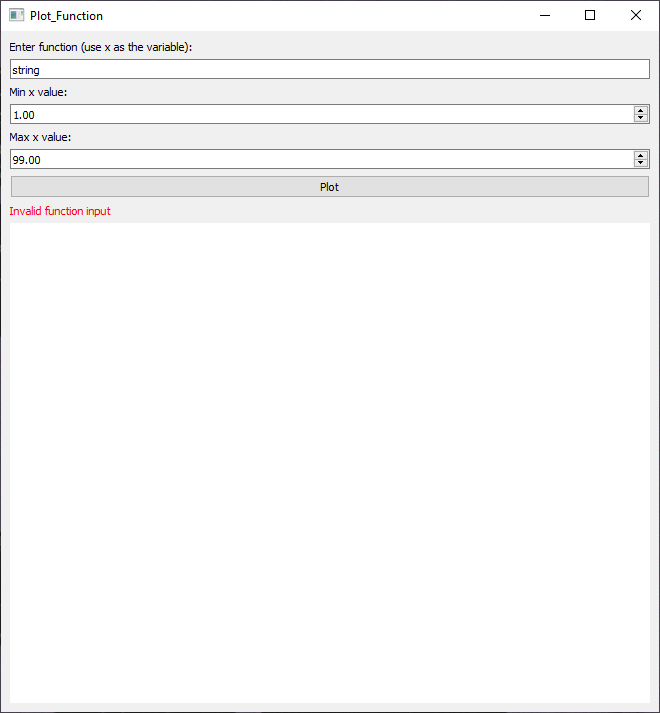
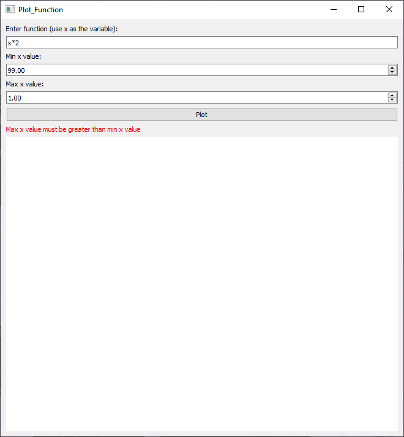
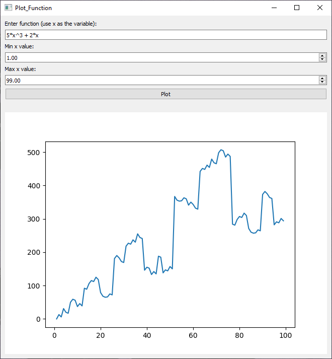
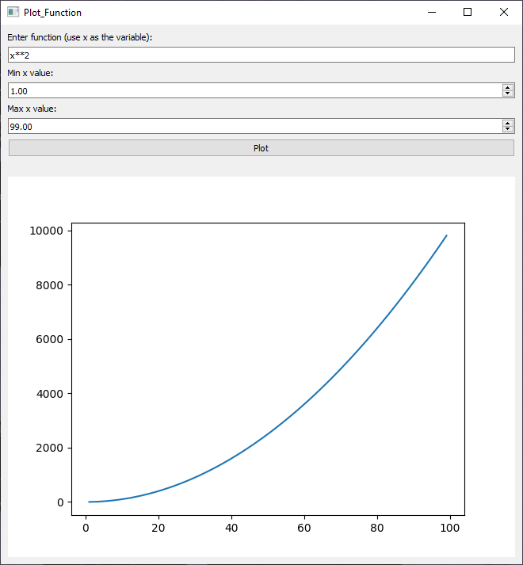

# Function Plotter

This is a plotting application built with PySide2 and pytest-qt. It allows users to input a mathematical function and plot it within a specified range.

## Features

- Input mathematical function
- Specify the range for the x-axis
- Plot the function within the specified range
- Error handling for invalid inputs
- The following operators are supported: + - / * ^.

## Working VS wrong examples

-first wrong example

 

-second wrong example

 

-first working example

 
 
-second working example

 

